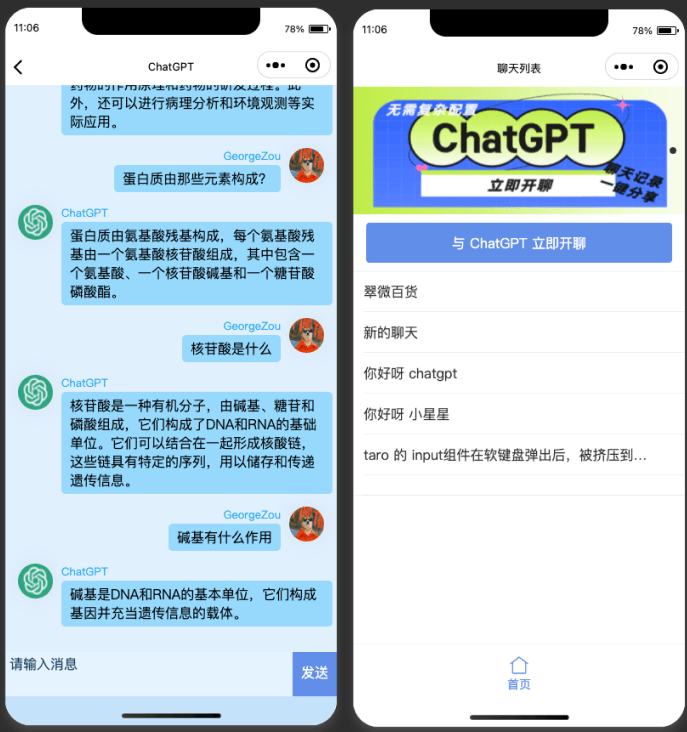
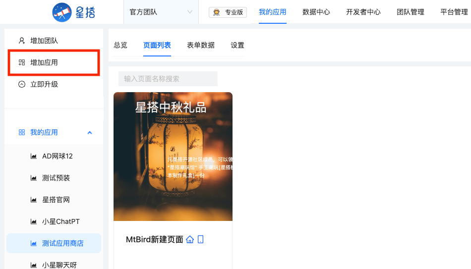
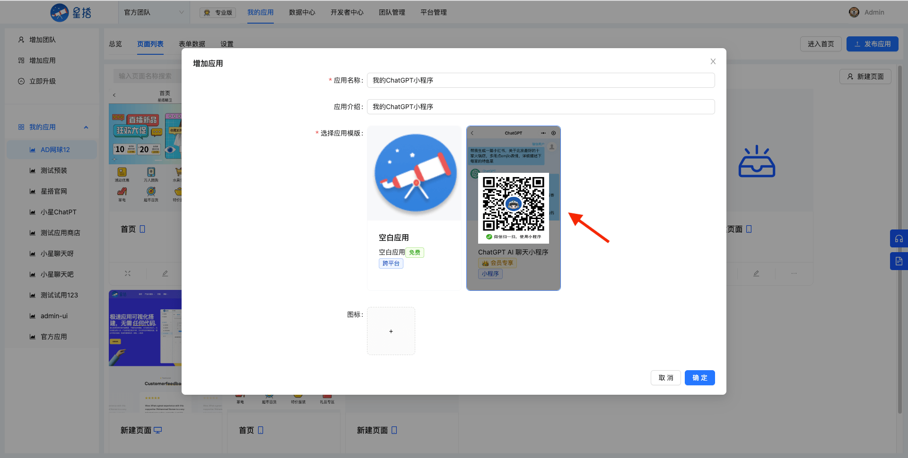
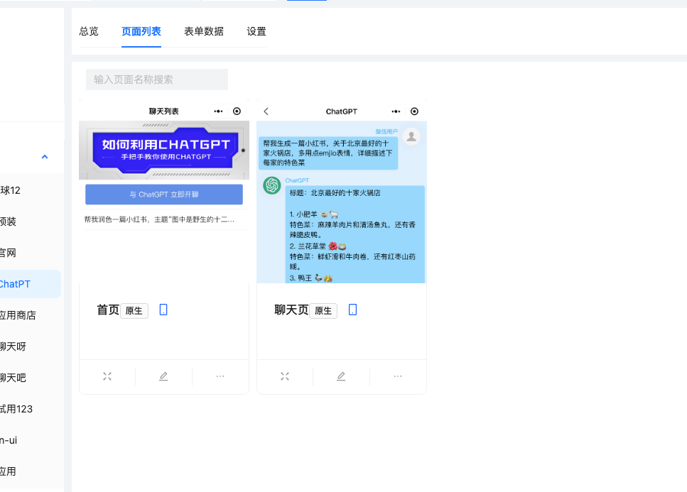
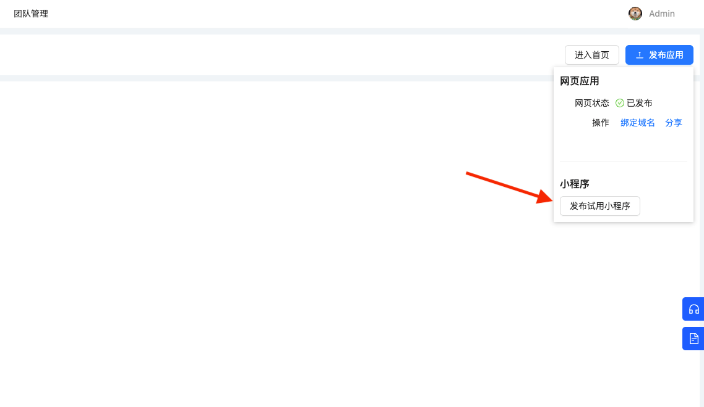
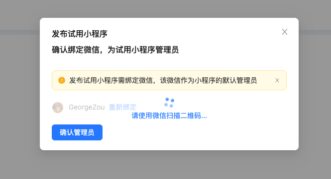
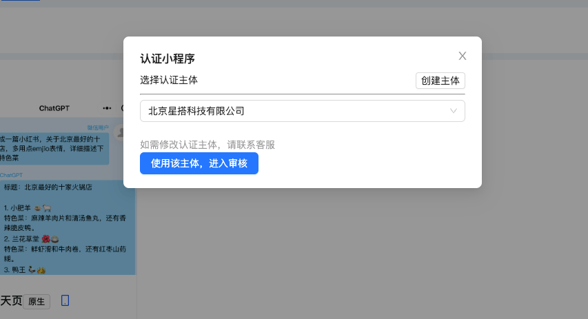
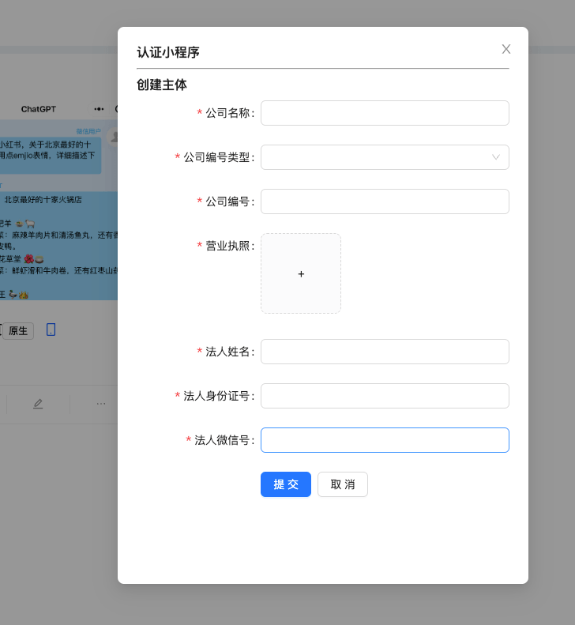
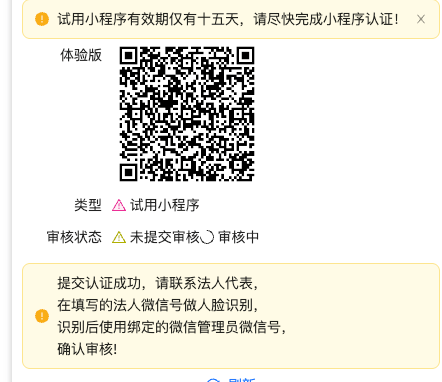
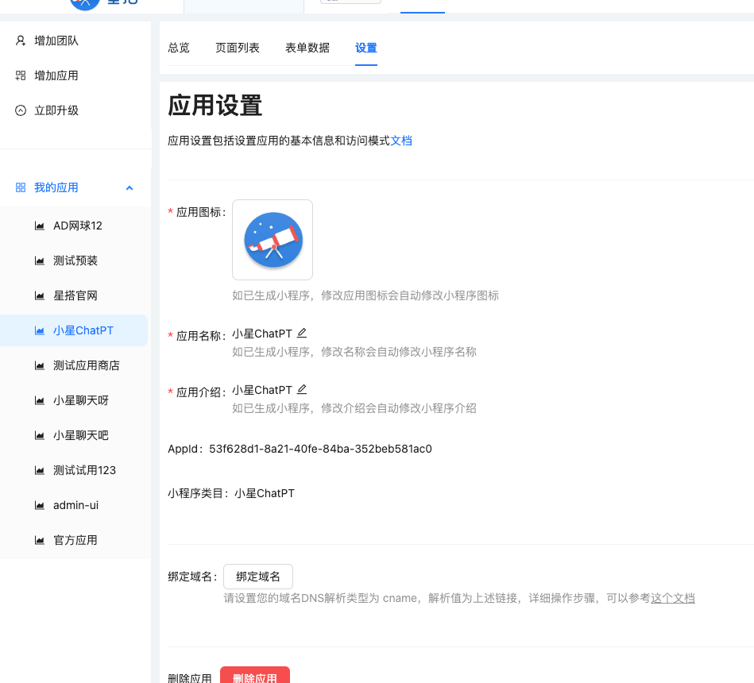

# 星搭小星 - ChatGPT 聊天小程序

对接 `ChatGPT` 的 `OpenAI` 接口，已更新最新的 `gpt-3.5-turbo-0301`，在国内实现与 `ChatGPT` 实时聊天，包含会话界面和聊天界面，一键分享聊天记录到微信聊天和朋友圈. 通过`星搭AI`代理，无需翻墙访问，也无需注册 `OpenAI` 账号.



## 立即体验


## 无需代码，五分钟上线 ChatGPT小程序

在[星搭低代码平台](https://staringos.com)的加持下，无需代码和小程序后台操作，也无需微信认证300元，无需翻墙访问，也无需注册 `OpenAI` 账号，五分钟即可上线一套ChatGPT小程序。

    Tips: 新注册用户，星搭会自动为您创建一个应用，您可以在 设置 -> 删除应用，将默认的应用删除后创新 ChatGPT应用哦

首先登录星搭低代码平台，点击`增加应用`



选择 `ChatGPT小程序`应用模版，输入应用名称。注意，这里的应用名称就是小程序的名称哦！需要符合微信小程序的[命名规则](https://kf.qq.com/faq/170109umMvm6170109MZNnYV.html)



点击确定，即应用新建完成，可以看到，这里两个页面已经新建好了。目前这两个页面还不能修改。（下个版本 3月13日上线，星搭将支持这两个页面的样式修改，敬请期待！）





点击右上角`发布应用`按钮，点击 `发布试用小程序` 按钮



扫码绑定管理员微信，并继续扫码授权星搭为您创建小程序

试用小程序即申请成功啦，您可以预览。注意试用小程序有效期仅有十五天，请尽快完成小程序认证！


点击认证为正式小程序，进入认证流程



如果当前账号没有主体，需要创建。注意信息的真实性和准确性，否则认证会不通过（星搭平台不会保存您的隐私数据，仅提供给微信进行认证​。）



​提交认证后，选择使用该主体进行认证，微信会给法人代表微信号发送认证信息，法人经过人脸识别后，即可将小程序认证为正式小程序。



认证成功后，需设置正式小程序的 名称、Icon、描述和类目，完成后即可正式上线。您也可以在应用设置里面修改这些信息哦～



整个流程非常简单，无需任何代码，快来创建你自己的ChatGPT小程序吧！

## 本地运行

1. 将 `src/config.example.ts` 重命名为 `src/config.ts`

2. 填充小程序的 `appId`
```ts
export const appId = ''
```

3. 安装依赖并启动
```shell
yarn
yarn run start
```

打开微信开发者工具，引入

### 加入社群 / 需求定制


